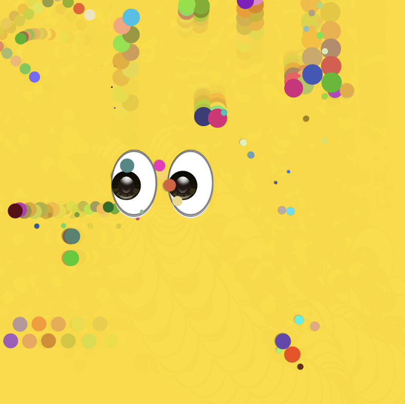
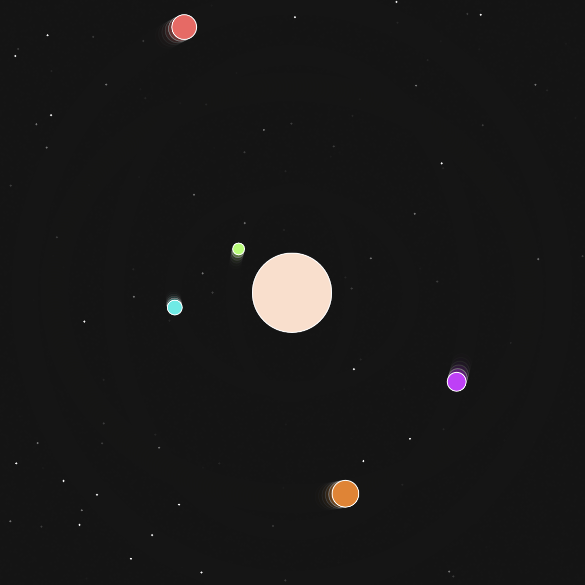
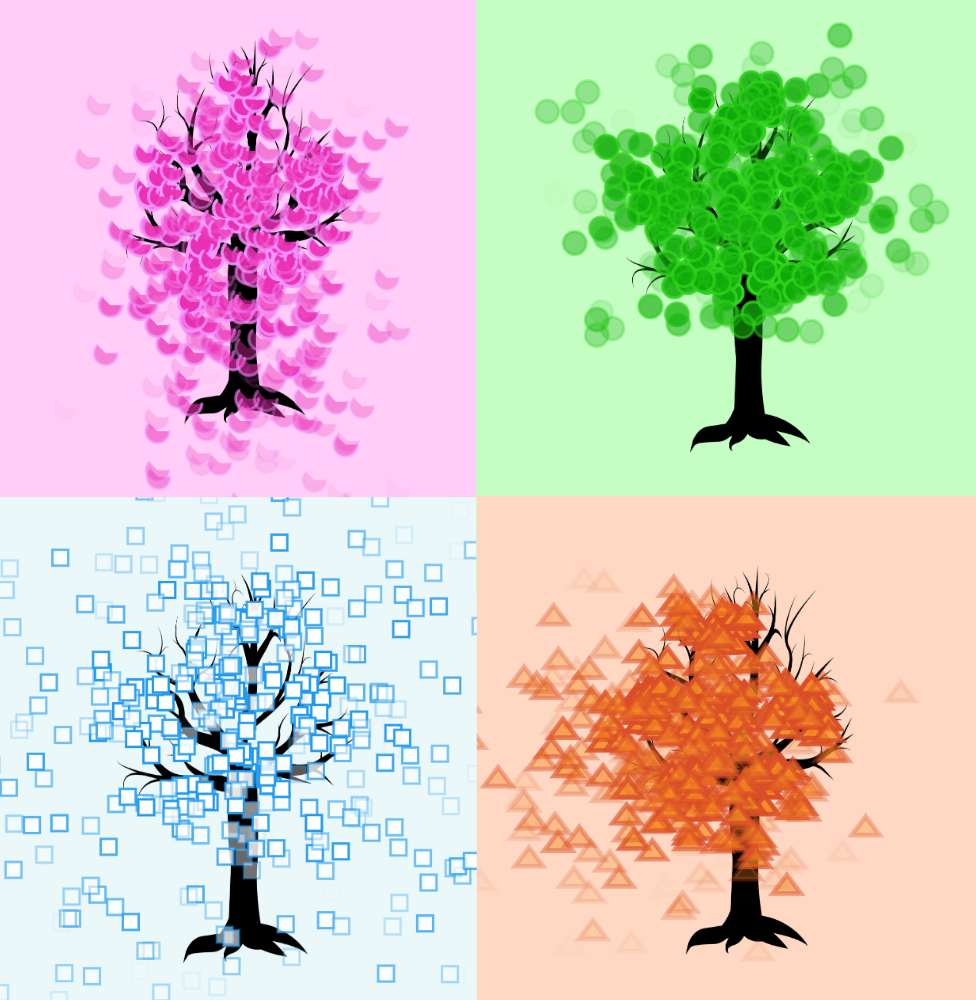
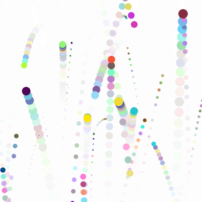

## Beomjun Kim
  * Seoul Institute of the Arts
  * Digital Arts
  * Creative Technology
  * Unity Programming
  * Mobile UI & UX Design

## Final Project 3 : 우리는 모르는 그들의 삶

  * [TheirLife](./TheirLife/)
  * 다양한 생물들은 우리가 모르는 사이에 그들만의 삶을 살고 있다.
  * 우리가 그들을 지켜보고 다루는 시간이 끝나면 그들만의 비밀스러운 삶이 시작된다.

## Final Project 2 : Convergence

 
  * [Convergence](./Convergence/)
  * 태양 : 우주의 중심
  * 지구, 잔다르, 타이탄, 이고, 사카아르 : 태양을 중심으로 제각각 돌며, 태양계를 구성하는 행성들, 출발점은 같으나 서로 속성이 달라 도는 궤도가 다르다.
  * 마우스를 누르고 있으면, 태양이 폭발하며 다른 행성들이 태양에 융합되며 Convergence가 이뤄진다.

## Final Project 1 : 사계

 
  * [4 SEASONS](./4Seasons/)
  * 마우스의 위치에 따라 계절이 바뀐다.
  * 마우스를 누르고 있으면 바람이 분다.
  * 봄 : 좌측상단구역 / 클릭하면 위에서 오는 바람 때문에, 벚꽃이 아래로 떨어진다.
  * 여름 : 우측상단구역 / 클릭하면 약한 산들바람 때문에, 나뭇잎이 살짝 부풀어 보이게 된다.
  * 가을 : 우측하단구역 / 클릭하면 우측상단에서부터 불어오는 바람 때문에, 단풍잎이 비스듬히 떨어진다.
  * 겨울 : 좌측하단구역 / 클릭하면 몰아치는 바람 때문에, 눈보라가 일어난다.

## 4th ArtWork : Grab FUN

 
  * [Grab FUN](./Fun/)
  * 끊임없이 톡톡튀며 반복되는 재미와 즐거움을 손으로 잡아라!
  * 마우스 우클릭을 이용한 컨트롤

## 3rd ArtWork : Emotions of RAIN

 
  * [Emotions of RAIN](./Rain/)
  * 비로 표현한 4가지 감정 ; 외로움 / 우울함 / 슬픔 / 절망

## 2nd ArtWork : Real STAR

 
  * [Real STAR](./Star/)
  * 진짜 별에 속하기 위하여 몸부림치는 별들
  * 마우스를 이용한 컨트롤

## 1st ArtWork : My RAINBOW

 
  * [My RAINBOW](./Rainbow/)
  * 내 맘대로 컨트롤 할 수 있는 무지개
  * 마우스를 이용한 컨트롤

## Practice B : Meteor
  * [Meteor](./Meteor/)

## Practice A : Waterfall
  * [Waterfall](./Waterfall/)
